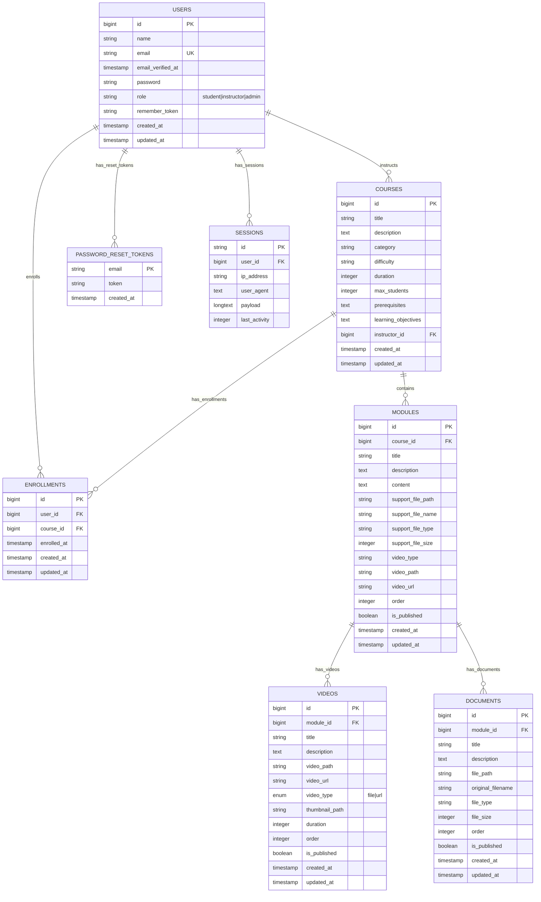

# EduFlow - Entity Relationship Diagram (ERD)

## Database Schema Overview

## Entity Descriptions

### 1. USERS Table
- **Purpose**: Stores user account information for students, instructors, and admins
- **Key Fields**: 
  - `id`: Primary key
  - `email`: Unique identifier for login
  - `role`: User role (student, instructor, admin)
  - `password`: Hashed password for authentication

### 2. COURSES Table
- **Purpose**: Stores course information and metadata
- **Key Fields**:
  - `id`: Primary key
  - `instructor_id`: Foreign key to USERS table (instructor)
  - `title`, `description`: Course basic info
  - `category`, `difficulty`: Course classification
  - `duration`, `max_students`: Course constraints
  - `prerequisites`, `learning_objectives`: Course requirements and goals

### 3. ENROLLMENTS Table
- **Purpose**: Junction table linking students to courses
- **Key Fields**:
  - `user_id`: Foreign key to USERS table (student)
  - `course_id`: Foreign key to COURSES table
  - `enrolled_at`: Timestamp when enrollment occurred

### 4. MODULES Table
- **Purpose**: Stores course modules/lessons with content and media
- **Key Fields**:
  - `id`: Primary key
  - `course_id`: Foreign key to COURSES table
  - `title`, `description`, `content`: Module information
  - `order`: Module sequence within course
  - `is_published`: Publication status
  - Support file fields: `support_file_path`, `support_file_name`, etc.
  - Video fields: `video_type`, `video_path`, `video_url`

### 5. VIDEOS Table
- **Purpose**: Stores video content associated with modules
- **Key Fields**:
  - `id`: Primary key
  - `module_id`: Foreign key to MODULES table
  - `title`, `description`: Video information
  - `video_path`, `video_url`: Video file location
  - `video_type`: Enum ('file' or 'url')
  - `duration`: Video length in seconds
  - `order`: Video sequence within module
  - `is_published`: Publication status

### 6. DOCUMENTS Table
- **Purpose**: Stores document files associated with modules
- **Key Fields**:
  - `id`: Primary key
  - `module_id`: Foreign key to MODULES table
  - `title`, `description`: Document information
  - `file_path`: File storage location
  - `original_filename`: Original file name
  - `file_type`: File format (pdf, ppt, doc, etc.)
  - `file_size`: File size in bytes
  - `order`: Document sequence within module
  - `is_published`: Publication status

### 7. PASSWORD_RESET_TOKENS Table
- **Purpose**: Laravel's built-in password reset functionality
- **Key Fields**:
  - `email`: Primary key, user's email (implicitly references USERS.email)
  - `token`: Reset token for password recovery
- **Note**: This table has an implicit relationship with USERS table via email field, but no explicit foreign key constraint

### 8. SESSIONS Table
- **Purpose**: Laravel's session management
- **Key Fields**:
  - `id`: Primary key, session identifier
  - `user_id`: Foreign key to USERS table
  - `payload`: Session data
  - `last_activity`: Session activity timestamp

## Relationships

1. **USERS → COURSES** (1:N): One instructor can create many courses
2. **USERS → ENROLLMENTS** (1:N): One student can enroll in many courses
3. **COURSES → ENROLLMENTS** (1:N): One course can have many student enrollments
4. **COURSES → MODULES** (1:N): One course can have many modules
5. **MODULES → VIDEOS** (1:N): One module can have many videos
6. **MODULES → DOCUMENTS** (1:N): One module can have many documents
7. **USERS → SESSIONS** (1:N): One user can have multiple active sessions
8. **USERS → PASSWORD_RESET_TOKENS** (1:N): One user can have multiple password reset tokens (implicit via email)

## Key Features

- **Role-based Access**: Users have roles (student, instructor, admin)
- **Course Management**: Instructors can create and manage courses
- **Content Organization**: Courses contain modules, which contain videos and documents
- **Enrollment System**: Students can enroll in multiple courses
- **Media Support**: Support for both file uploads and URL-based content
- **Publication Control**: Content can be published/unpublished
- **Ordering System**: Modules, videos, and documents have sequence ordering
- **File Management**: Comprehensive file metadata tracking

## Database Constraints

- Foreign key constraints with CASCADE delete for data integrity
- Unique constraints on email addresses
- Indexes on frequently queried fields (course_id + order combinations)
- Proper data types for different content (text for descriptions, integers for sizes/durations)

## Why PASSWORD_RESET_TOKENS Has No Explicit Foreign Key

The `PASSWORD_RESET_TOKENS` table doesn't have an explicit foreign key constraint for several reasons:

1. **Laravel's Design Choice**: Laravel uses the email as the primary key for password reset tokens, which allows password resets even if a user doesn't exist yet (useful for registration flows)

2. **Temporary Nature**: Password reset tokens are temporary and automatically cleaned up by Laravel's scheduled tasks

3. **Email-based Relationship**: The relationship is maintained through the email field, which implicitly references `USERS.email`

4. **Flexibility**: This design allows password reset functionality to work even if the user table structure changes

5. **Performance**: No foreign key constraint means faster token creation and deletion operations

The relationship is still valid and functional - Laravel handles the email validation and user lookup when processing password reset requests. 