# EduFlow - Development Gantt Chart (1 Month Timeline)

## Project Overview
This Gantt chart outlines the development timeline for the EduFlow Learning Management System over a 1-month period, including all major phases from initial setup to deployment and testing.

## Gantt Chart

```mermaid
gantt
    title EduFlow LMS Development Timeline (1 Month)
    dateFormat  YYYY-MM-DD
    section Project Setup
    Project Initialization           :done, setup, 2024-01-01, 2d
    Environment Configuration       :done, setup, after setup, 1d
    Database Design                 :done, setup, after setup, 2d
    Git Repository Setup            :done, setup, after setup, 1d
    
    section Core Infrastructure
    Laravel Installation            :done, core, 2024-01-03, 1d
    Authentication System           :done, core, after core, 3d
    User Management                 :done, core, after core, 2d
    Role-based Access Control       :done, core, after core, 2d
    Database Migrations             :done, core, after core, 1d
    
    section Database & Models
    User Model Development          :done, models, 2024-01-08, 1d
    Course Model Development        :done, models, after models, 1d
    Module Model Development        :done, models, after models, 1d
    Video Model Development         :done, models, after models, 1d
    Document Model Development      :done, models, after models, 1d
    Enrollment Model Development    :done, models, after models, 1d
    Comment Model Development       :done, models, after models, 1d
    
    section Backend Development
    Authentication Controllers      :done, backend, 2024-01-12, 2d
    User Controller                 :done, backend, after backend, 1d
    Course Controller               :done, backend, after backend, 2d
    Module Controller               :done, backend, after backend, 2d
    Video Controller                :done, backend, after backend, 2d
    Document Controller             :done, backend, after backend, 2d
    Enrollment Controller           :done, backend, after backend, 1d
    Comment Controller              :done, backend, after backend, 1d
    Admin Controller                :done, backend, after backend, 2d
    Progress Controller             :done, backend, after backend, 1d
    
    section Frontend Development
    Layout Templates                :done, frontend, 2024-01-20, 2d
    Authentication Views            :done, frontend, after frontend, 2d
    Dashboard Views                 :done, frontend, after frontend, 2d
    Course Management Views         :done, frontend, after frontend, 3d
    Module Management Views         :done, frontend, after frontend, 2d
    Video Management Views          :done, frontend, after frontend, 2d
    Document Management Views       :done, frontend, after frontend, 2d
    Enrollment Views                :done, frontend, after frontend, 1d
    Progress Tracking Views         :done, frontend, after frontend, 2d
    Admin Dashboard Views           :done, frontend, after frontend, 3d
    
    section UI/UX Design
    Design System Setup             :done, design, 2024-01-25, 1d
    Component Library               :done, design, after design, 2d
    Responsive Design               :done, design, after design, 2d
    User Experience Optimization    :done, design, after design, 2d
    
    section File Management
    File Upload System              :done, files, 2024-01-28, 2d
    Video Processing                :done, files, after files, 2d
    Document Storage                :done, files, after files, 1d
    Thumbnail Generation            :done, files, after files, 1d
    
    section Advanced Features
    Email Verification System       :done, advanced, 2024-01-30, 1d
    OTP Authentication              :done, advanced, after advanced, 1d
    Password Reset Functionality    :done, advanced, after advanced, 1d
    Notification System             :done, advanced, after advanced, 2d
    Comment System                  :done, advanced, after advanced, 1d
    Announcement System             :done, advanced, after advanced, 1d
    
    section Analytics & Reporting
    Analytics Dashboard             :done, analytics, 2024-02-02, 2d
    User Statistics                 :done, analytics, after analytics, 1d
    Course Analytics                :done, analytics, after analytics, 1d
    Enrollment Reports              :done, analytics, after analytics, 1d
    Progress Tracking               :done, analytics, after analytics, 2d
    
    section Testing & Quality Assurance
    Unit Testing                    :done, testing, 2024-02-05, 2d
    Integration Testing             :done, testing, after testing, 2d
    User Acceptance Testing         :done, testing, after testing, 2d
    Performance Testing             :done, testing, after testing, 1d
    Security Testing                :done, testing, after testing, 1d
    Cross-browser Testing           :done, testing, after testing, 1d
    
    section Documentation
    API Documentation               :done, docs, 2024-02-10, 1d
    User Manual                     :done, docs, after docs, 2d
    Admin Guide                     :done, docs, after docs, 1d
    Deployment Guide                :done, docs, after docs, 1d
    
    section Deployment & Launch
    Production Environment Setup    :done, deploy, 2024-02-13, 1d
    Database Migration              :done, deploy, after deploy, 1d
    SSL Certificate Setup           :done, deploy, after deploy, 1d
    Performance Optimization        :done, deploy, after deploy, 1d
    Final Testing                   :done, deploy, after deploy, 1d
    Go Live                        :done, deploy, after deploy, 1d
    
    section Post-Launch
    Monitoring Setup                :done, post, 2024-02-18, 1d
    Backup System                   :done, post, after post, 1d
    Bug Fixes & Hotfixes            :done, post, after post, 2d
    User Training                   :done, post, after post, 1d
    Performance Monitoring          :done, post, after post, 2d
```

## Detailed Timeline Breakdown

### Week 1 (January 1-7): Foundation & Setup
**Days 1-2: Project Initialization**
- Project planning and requirements gathering
- Development environment setup
- Git repository initialization
- Team coordination and task assignment

**Days 3-4: Environment & Database**
- Laravel framework installation
- Database design and schema planning
- Development environment configuration
- Version control setup

**Days 5-7: Core Infrastructure**
- Authentication system implementation
- User management foundation
- Role-based access control setup
- Basic database migrations

### Week 2 (January 8-14): Backend Development
**Days 8-10: Model Development**
- User model with role management
- Course model with relationships
- Module model with content organization
- Video and Document models
- Enrollment and Comment models

**Days 11-14: Controller Development**
- Authentication controllers (login, register, password reset)
- User management controller
- Course CRUD operations
- Module management
- Video and document handling

### Week 3 (January 15-21): Frontend Development
**Days 15-17: Core Views**
- Layout templates and navigation
- Authentication views (login, register, verification)
- Dashboard views for different user roles
- Course listing and detail views

**Days 18-21: Management Interfaces**
- Course creation and editing forms
- Module management interface
- Video upload and management
- Document management system
- Enrollment interface

### Week 4 (January 22-28): Advanced Features
**Days 22-24: UI/UX Enhancement**
- Design system implementation
- Component library development
- Responsive design optimization
- User experience improvements

**Days 25-28: File Management**
- File upload system implementation
- Video processing and optimization
- Document storage and retrieval
- Thumbnail generation for videos

### Week 5 (January 29 - February 4): Advanced Features & Analytics
**Days 29-31: Security & Communication**
- Email verification system
- OTP authentication implementation
- Password reset functionality
- Notification system

**Days 1-4: Analytics & Reporting**
- Analytics dashboard development
- User statistics and metrics
- Course performance analytics
- Enrollment and progress reports

### Week 6 (February 5-11): Testing & Documentation
**Days 5-8: Comprehensive Testing**
- Unit testing for all components
- Integration testing
- User acceptance testing
- Performance and security testing
- Cross-browser compatibility testing

**Days 9-11: Documentation**
- API documentation
- User manual creation
- Admin guide development
- Deployment documentation

### Week 7 (February 12-18): Deployment & Launch
**Days 12-15: Production Setup**
- Production environment configuration
- Database migration to production
- SSL certificate installation
- Performance optimization
- Final testing and validation

**Days 16-18: Go Live & Monitoring**
- System launch
- Monitoring setup
- Backup system implementation
- Initial bug fixes and hotfixes

### Week 8 (February 19-25): Post-Launch Support
**Days 19-21: Stabilization**
- User training and onboarding
- Performance monitoring and optimization
- Bug fixes and improvements
- User feedback collection

**Days 22-25: Optimization**
- Performance tuning
- Security enhancements
- Feature refinements
- Documentation updates

## Key Milestones

### Week 1 Milestone: Foundation Complete
- ✅ Development environment ready
- ✅ Database schema designed
- ✅ Authentication system functional
- ✅ Basic user management working

### Week 2 Milestone: Backend Complete
- ✅ All models and relationships established
- ✅ Core controllers implemented
- ✅ CRUD operations functional
- ✅ API endpoints ready

### Week 3 Milestone: Frontend Complete
- ✅ All user interfaces implemented
- ✅ Course management functional
- ✅ Content management working
- ✅ User experience optimized

### Week 4 Milestone: Advanced Features Complete
- ✅ File management system operational
- ✅ Security features implemented
- ✅ Communication tools functional
- ✅ UI/UX polished

### Week 5 Milestone: Analytics Complete
- ✅ Analytics dashboard functional
- ✅ Reporting system operational
- ✅ Progress tracking implemented
- ✅ Performance metrics available

### Week 6 Milestone: Testing Complete
- ✅ All tests passing
- ✅ Documentation complete
- ✅ Quality assurance approved
- ✅ Ready for deployment

### Week 7 Milestone: Production Ready
- ✅ Production environment stable
- ✅ Security measures in place
- ✅ Performance optimized
- ✅ System launched successfully

### Week 8 Milestone: System Stable
- ✅ Users trained and onboarded
- ✅ Performance monitored and optimized
- ✅ Bugs resolved
- ✅ System fully operational

## Resource Allocation

### Development Team (4-6 people)
- **Backend Developer (2)**: Laravel, database, APIs
- **Frontend Developer (2)**: UI/UX, responsive design
- **DevOps Engineer (1)**: Deployment, infrastructure
- **QA Engineer (1)**: Testing, quality assurance

### Technology Stack
- **Backend**: Laravel 10, PHP 8.1, MySQL
- **Frontend**: Blade templates, Tailwind CSS, Alpine.js
- **File Storage**: Laravel Storage, AWS S3 (optional)
- **Email**: Laravel Mail, SMTP
- **Deployment**: VPS/Cloud hosting, SSL certificates

## Risk Management

### High-Risk Items
1. **File Upload Security**: Implement strict validation and virus scanning
2. **Video Processing**: Use queue jobs for large file processing
3. **Database Performance**: Optimize queries and implement caching
4. **User Authentication**: Implement rate limiting and security measures

### Mitigation Strategies
- Regular security audits and penetration testing
- Performance monitoring and optimization
- Automated backup systems
- Comprehensive error logging and monitoring
- User training and support documentation

## Success Criteria

### Technical Success
- All features implemented and functional
- Performance benchmarks met
- Security requirements satisfied
- Cross-browser compatibility achieved

### Business Success
- System launched on schedule
- User adoption targets met
- Performance metrics within acceptable ranges
- Positive user feedback received

This Gantt chart provides a comprehensive roadmap for developing the EduFlow LMS system over a 1-month period, with clear milestones, resource allocation, and risk management strategies. 